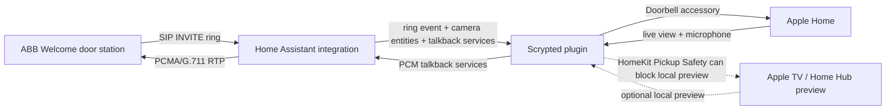

# ABB Welcome - Home Assistant integration

[](https://my.home-assistant.io/redirect/hacs_repository/?owner=rankjie&repository=ha-abb-welcome&category=integration)

Local controls, ring detection, and live intercom streams for ABB Welcome /
Busch-Jaeger building intercoms backed by a web-admin **IP gateway** (system
type `mrange`) or an app-managed M2240x/ASI22 Wi-Fi indoor station.

This integration is LAN-first. Pairing uses the ABB MyBuildings cloud portal
once, then unlocks, realtime ring detection, and live video/audio run directly
against the gateway on your local network.

For Apple Home / HomeKit, use the companion
[ABB HA Doorbell Scrypted plugin][scrypted-bridge]. The Scrypted plugin imports
ABB Welcome stations into Apple Home as full HomeKit doorbells with live video,
doorbell notifications, and two-way audio.

> [!IMPORTANT]
> **Want ABB Welcome in Apple Home? Use Scrypted.**
>
> HA's native HomeKit bridge can expose a basic camera/ring sensor, but it does
> not provide the full HomeKit doorbell experience. For Apple Home notifications,
> live video, audio, talkback, and safer pickup handling, install this HA
> integration first, then add the companion
> [ABB HA Doorbell Scrypted plugin][scrypted-bridge].

## Features

- One Home Assistant **button entity per unlock-capable outdoor station**.
- **Camera entities** for discovered door stations, backed by HA's bundled
  go2rtc/WebRTC path.
- **LAN H.264 video + PCMA/G.711 audio** for live intercom streams.
- **Talkback services** for the active stream. The Scrypted plugin uses these to
  provide HomeKit microphone audio.
- **Streaming enabled switch** to explicitly arm live streaming. Turning it off
  tears down active streams and hangs up active calls.
- **Allow pickup switch** for incoming doorbell calls. When disabled, HA will not
  accept the ringing INVITE, leaving phones and indoor stations free to answer.
- **Realtime ring binary sensor** that listens for local SIP INVITE packets and
  fires quickly when someone presses the doorbell.
- `abb_welcome_ring` Home Assistant event with station id, station name, caller
  URI, call id, and timestamp.
- **Image entity** with the latest gateway screenshot from event history.
- **Event entity** and **last-event sensor** for ring / call / door-open history.
- **Refresh Events** button for a manual portal event poll.
- **Refresh outdoor stations** service for re-reading the door list on
  web-admin gateways. App-managed topology currently requires re-pairing.
- Switchable unlock strategy for gateways that need a different SIP unlock path.
- LAN RTSP proxy for Scrypted/HomeKit, with automatic free-port selection and
  discovery refresh events.

## Requirements

- A supported ABB Welcome device reachable on your local network:
  - ABB **83342** or another `mrange` IP gateway with web admin, or
  - an **M2240x/ASI22 Wi-Fi indoor station** with SIP-TLS port 5061 reachable.
- An **ABB-Welcome / Busch-Jaeger MyBuildings** account already linked to that
  gateway.
- For web-admin gateways only, the gateway admin password used at
  `https://<gateway-ip>/`.
- For app-managed devices, the private MyBuildings **system ID / Portal UUID**.
- For Apple Home: a working Scrypted installation and the
  [ABB HA Doorbell Scrypted plugin][scrypted-bridge].

## Installation

### HACS

Click the badge to add this repository to HACS:

[](https://my.home-assistant.io/redirect/hacs_repository/?owner=rankjie&repository=ha-abb-welcome&category=integration)

Then install **ABB Welcome** from HACS and restart Home Assistant.

If the badge does not work, open HACS -> **Custom repositories**, add
`https://github.com/rankjie/ha-abb-welcome` as an *Integration*, and install it.

### Manual

Copy `custom_components/abb_welcome/` into Home Assistant's
`config/custom_components/` directory and restart Home Assistant.

## Home Assistant Setup

Open Settings -> **Devices & Services** -> **Add Integration** -> **ABB Welcome**.

First choose a device profile:

- **Web-admin IP gateway (83342 / MRANGE)** keeps the existing HTTPS/CGI setup.
- **App-managed Wi-Fi indoor station (M2240x / ASI22)** uses SIP-TLS port 5061
  and MyBuildings app pairing; it never contacts port 443
  or asks for a gateway admin password.

Then fill in:

- MyBuildings portal **username**
- MyBuildings portal **password**
- Gateway local **IP address**
- Gateway **web admin password** (web-admin profile only)
- Gateway **Portal UUID / MyBuildings system ID** (required for app-managed)

Optional: if automatic setup cannot read the gateway UUID from the local
`portalclient.cgi` endpoint, fill in **Gateway Portal UUID** from the gateway web
admin Portal page or ABB Welcome mobile app, then retry.

Both profiles:

1. Generates a fresh RSA keypair and requests a client certificate from the
   MyBuildings portal.
2. Computes the gateway integrity code from the certificate fingerprint.
3. Sends one `welcome.connect` event so the device sees a pending pairing.
4. Polls for the gateway ACL update, decrypts the SIP password, reads the door
   list, and creates HA entities.

For a web-admin gateway, setup reads the gateway UUID from its CGI (unless an
override was supplied), then logs into the CGI to approve the pending client.
For an app-managed device, setup uses the required Portal UUID directly and
immediately polls for the ACL produced by MyBuildings app pairing. It never calls
the local CGI or waits for a panel approval action.

A successful web-admin pairing typically completes in under 15 seconds.

For an app-managed device, the integration creates one `ha-*` client and shows
its client name and integrity code, persists the identity, then immediately polls
for its ACL update. M2240x/ASI22 additional apps normally pair automatically when
they use the same MyBuildings account. The M22403-W does not expose an approval
screen on the panel; ABB's generic pairing email also describes other product
families that do. If polling times out, wait and submit again. If the official
Welcome app shows the station as unpaired and offers **Resend pairing request**,
use that option; do not unpair an `ha-*` client already shown as paired.

The pending private identity is stored in Home Assistant's private storage. A
later config flow can resume the same certificate, client identity, and
`welcome.connect` request after a browser reload or Home Assistant restart; it
does not consume another client slot. MyBuildings credentials are used only for
the initial certificate request and the password is not stored. The recovery
screen also provides an explicitly confirmed discard path for clients that have
already been removed/unpaired.

## Apple Home / HomeKit

> [!IMPORTANT]
> **Full Apple Home doorbell = HA integration + Scrypted plugin.**
>
> Do **not** rely on HA's native HomeKit bridge if you want a real Apple Home
> doorbell. HA can expose a one-way camera and ring sensor, but the usable
> HomeKit microphone path, Apple Home doorbell accessory, and pickup-safety
> controls are provided by the companion
> [ABB HA Doorbell Scrypted plugin][scrypted-bridge].

| Goal | Use |
|---|---|
| Door buttons, HA cameras, ring events, SIP/RTP media, talkback services | This Home Assistant integration |
| Import ABB stations into Apple Home as full HomeKit doorbells | [ABB HA Doorbell Scrypted plugin][scrypted-bridge] |
| HomeKit microphone / two-way audio | Scrypted plugin, backed by HA talkback services |
| Apple TV/Home Hub preview blocking | Scrypted plugin **HomeKit Pickup Safety** |
| Basic one-way HomeKit camera only | HA native HomeKit bridge, if you do not need talkback |



Recommended setup:

1. Install and configure this HA integration.
2. Confirm the HA camera stream works by turning on
   `switch.<gateway>_streaming_enabled` and opening a camera.
3. Install the [Scrypted plugin][scrypted-bridge].
4. In the Scrypted plugin settings, enter:
   - **Home Assistant URL**
   - **Home Assistant Token** (a long-lived access token)
5. Leave **Primary Door Station** blank unless you want a specific station to
   keep the existing `front-door` HomeKit identity.
6. Add the Scrypted doorbells to Scrypted's HomeKit plugin.
7. Keep Scrypted HomeKit **Transcode Video** and **Transcode Audio** enabled.
   The plugin enables them automatically, but they should stay on for reliable
   Home app video and audio.

The Scrypted plugin discovers HA camera entities, station ids, ring state,
snapshot image data, the streaming switch, and each camera's `lan_rtsp_url`.
When HA reloads or moves the LAN RTSP proxy to another port, it fires
`abb_welcome_discovery_changed`; Scrypted listens for that event and refreshes
without subscribing to every HA entity.

### Doorbell Ring Flow

The intended Apple Home flow is:

1. Someone presses a door station.
2. HA receives the local SIP `INVITE`.
3. HA fires `abb_welcome_ring` and updates the ring binary sensor.
4. Scrypted turns that into a HomeKit doorbell notification.
5. If the user opens the Home notification or live view, Scrypted asks HA for the
   matching stream.
6. HA accepts the pending incoming call for that station, or proactively dials
   the station for manual live view.
7. HomeKit receives video/audio, and HomeKit microphone audio is sent back
   through HA talkback services.

Receiving the ring does **not** answer the intercom by itself. HA only arms the
stream. The call is accepted when a real stream consumer opens the camera.

### Allow Pickup

`switch.<gateway>_allow_pickup` controls whether HA/Scrypted/HomeKit may answer
an incoming ringing call.

- **On**: an incoming ring arms streaming for that station. Opening the matching
  camera from HomeKit can pick up the ringing call.
- **Off**: an incoming ring force-disarms streaming. HA still reports the ring,
  but it refuses HomeKit/Scrypted pickup so phones and indoor stations can
  answer safely.

This is independent from manual proactive streaming. You can still turn on
`Streaming enabled` and open a camera outside a ring.

### Apple TV / Home Hub Preview

Apple TV and some Home Hubs may open a local preview immediately after a
doorbell ring. ABB Welcome intercom media is exclusive, so an automatic preview
can occupy the call before a person answers.

If Apple Home uses an Apple TV or Home Hub:

- Configure **HomeKit Pickup Safety** in the Scrypted plugin.
- Assign the Apple TV/Home Hub a fixed LAN IP if possible.
- Enter that IP in Scrypted's **Apple TV / Home Hub IPs** setting if you want
  automatic local previews blocked.
- Leave the IP field blank if you do not want preview blocking.
- Do not enable Scrypted Rebroadcast or Prebuffer for ABB doorbells.

The Scrypted block only rejects matching **local** HomeKit preview requests
during the ring window. Manual Home app viewing and remote viewing through the
same Home Hub remain allowed.

## Entities

The integration creates one HA device for the gateway.

For each unlock-capable outdoor station:

- `button.<gateway>_<door_name>` - unlocks that station.
- `camera.<gateway>_<door_name>` - live intercom stream for that station.

Gateway-level entities:

- `switch.<gateway>_streaming_enabled` - arms stream startup for a short window.
  Turning it off tears down active streams/calls.
- `switch.<gateway>_allow_pickup` - allows or refuses incoming-call pickup.
- `binary_sensor.<gateway>_intercom_ringing` - turns on briefly when a SIP ring
  is observed.
- `image.<gateway>_latest_screenshot` - latest gateway screenshot from event
  history.
- `event.<gateway>_intercom` - ring / call / door-open event entity.
- `sensor.<gateway>_last_event` - latest non-screenshot portal event.
- `sensor.<gateway>_sip_listener` - diagnostic state for the realtime SIP
  listener.
- `button.<gateway>_refresh_events` - manually poll portal event history.

Unlock example:

```yaml
service: button.press
target:
  entity_id: button.abb_welcome_outdoor_1
```

## Streaming

ABB intercom media is exclusive, so live streams are gated.

Manual stream:

1. Turn on `switch.<gateway>_streaming_enabled`.
2. Open the desired `camera.<gateway>_<door_name>` within the armed window.
3. HA dials the selected station and passes H.264 video plus PCMA/G.711 audio to
   go2rtc/WebRTC and to Scrypted/HomeKit.

Turning off `switch.<gateway>_streaming_enabled` immediately disarms streaming
and closes active stream sessions.

The switch exposes useful attributes:

- `reason`: why streaming is armed (`manual`, `ring`, etc.).
- `target_station_id`: station id allowed during a ring-scoped arm.
- `remaining_seconds`: time left in the arm window.

You can also arm streaming from an automation:

```yaml
service: abb_welcome.arm_streaming
data:
  station_id: "100000001"
  duration: 60
```

## Talkback

HA exposes talkback as services for the currently active stream. These services
are mainly intended for the Scrypted plugin.

- `abb_welcome.talk_start`
- `abb_welcome.talk_stop`
- `abb_welcome.talk_pcm16le`
- `abb_welcome.talk_tone`
- `abb_welcome.play_audio`
- `abb_welcome.announce`

The audio format for `talk_pcm16le` is base64-encoded 8 kHz mono signed 16-bit
little-endian PCM. HA converts it to continuous PCMA/G.711 A-law RTP on the
active call's audio leg. Idle talkback sends silence continuously, and voice
frames are queued into the same RTP sequence.

**Talkback output gain** is configurable from **ABB Welcome options** between
0.0 and 3.0 dB. App-managed M2240x/ASI22 devices default to 3.0 dB; web-admin
gateways and legacy entries default to 0.0 dB, which preserves the previous
talkback bytes exactly. The setting applies to every outbound talkback source,
including live microphone PCM, client-generated speech/audio, and the explicit
`talk_tone` service. A small stateful peak limiter prevents the gain from
overflowing loud PCM frames and releases smoothly afterward. This is fixed gain
with peak protection, not an implementation or equivalent of FFmpeg
`loudnorm`, and it does not add an automatic chime or pre-tone.

Scrypted assigns a per-client `talkback_session_id` so stale clients cannot stop
or overwrite a newer microphone session.

`abb_welcome.play_audio` resolves an audio selection through Home Assistant's
media-source system, converts it to the talkback format, and plays it in real
time. It supports local media and Home Assistant TTS media-source output only;
arbitrary URLs and filesystem paths are rejected. The selected camera stream
must already be active. Input is limited to 20 MiB and playback to 30 seconds,
and the configured talkback output gain applies.

Front-door example:

```yaml
action: abb_welcome.play_audio
data:
  entity_id: camera.abb_welcome_front_door
  media:
    media_content_id: media-source://media_source/local/front-door-message.mp3
    media_content_type: audio/mpeg
```

Back-door example using a TTS media-source selection:

```yaml
action: abb_welcome.play_audio
data:
  entity_id: camera.abb_welcome_back_door
  talkback_session_id: back-door-announcement
  media:
    media_content_id: media-source://tts/example-provider/example-message
    media_content_type: audio/mpeg
```

Choose the TTS item with Home Assistant's media picker; the TTS identifier above
is only a generic placeholder.

`abb_welcome.announce` is the unattended alternative: Home Assistant generates
and fully decodes the speech first, then opens a short-lived intercom call,
plays the message, and hangs up. It refuses to run while any related camera
stream, visitor call, RTSP client, talkback owner, or another announcement is
active; it never reuses or interrupts an existing stream. Messages are limited
to 500 characters, decoded playback is limited to 30 seconds, and the configured
talkback output gain and peak limiter apply.

Default TTS provider example (replace the camera and message placeholders):

```yaml
action: abb_welcome.announce
data:
  entity_id: camera.abb_welcome_front_door
  message: "<message to announce>"
  talkback_session_id: "<optional-automation-id>"
```

Explicit TTS entity and language example:

```yaml
action: abb_welcome.announce
data:
  entity_id: camera.abb_welcome_back_door
  message: "<message to announce>"
  tts_entity_id: tts.example_provider
  language: en
```

AppDaemon should request the unlock first and announce only after the unlock
action reports success. The exact success check belongs in the AppDaemon app;
the compact example below leaves that application-specific check explicit:

```python
def unlock_and_announce(self, _event_name, _data, _kwargs):
    unlock_succeeded = self.unlock_selected_door()
    if not unlock_succeeded:
        return
    self.call_service(
        "abb_welcome/announce",
        entity_id="camera.abb_welcome_front_door",
        message="The door is open.",
        talkback_session_id="appdaemon-entry",
    )
```

## Scrypted RTSP Endpoint

Scrypted needs a LAN-reachable RTSP URL. HA's bundled go2rtc RTSP listener is
localhost-only, so this integration exposes it through a small LAN TCP proxy.

Port selection starts at:

```text
rtsp://<home-assistant-lan-ip>:18556/<go2rtc_stream>
```

Each camera exposes:

- `go2rtc_stream`: the stream name, such as `abb_100000001`.
- `lan_rtsp_url`: the complete URL Scrypted should use.
- `lan_rtsp_proxy_port`: the selected proxy port.
- `lan_rtsp_proxy_running`: whether the proxy is running.

On setup/reload, the integration tries the saved preferred port first. If that
port is occupied, it scans upward from `18556`, starts on the first free port,
and persists the new port in the config entry options. This avoids requiring a
hard-coded reserved port.

After camera entities load, HA fires `abb_welcome_discovery_changed` with the
current proxy host, port, running state, and change reason. The Scrypted plugin
uses that event to refresh its station list and RTSP URLs.

## Services

- `abb_welcome.refresh_doors` - re-read outdoor stations from a web-admin
  gateway and reload the entry if the list changed. App-managed devices return
  an unsupported error; re-pair after topology changes.
- `abb_welcome.arm_streaming` - arm streaming for all stations or one
  `station_id`.
- `abb_welcome.talk_start` - start sending queued microphone audio on the active
  stream.
- `abb_welcome.talk_stop` - stop voice audio and return the talkback leg to
  silence.
- `abb_welcome.talk_pcm16le` - queue base64 PCM16LE microphone audio.
- `abb_welcome.talk_tone` - send a short generated tone for testing.
- `abb_welcome.play_audio` - play local media or Home Assistant TTS audio on the
  active camera stream (maximum 30 seconds and 20 MiB source size).
- `abb_welcome.announce` - generate up to 500 characters of speech, play at most
  30 seconds through a new temporary call, then hang up; active streams or calls
  are never interrupted.
- `abb_welcome.export_credentials` - export stored SIP/gateway credentials to a
  JSON file for local debugging. This output contains secrets.

## Realtime Ring Event

Every incoming SIP ring fires `abb_welcome_ring` on the Home Assistant event bus.

Example payload:

```json
{
  "caller_uri": "sip:100000001@ipgw6cce7a2bb673;user=phone",
  "caller_user": "100000001",
  "station_id": "100000001",
  "station": "Outdoor 1",
  "station_name": "Outdoor 1",
  "call_id": "1293890397@192.168.178.112",
  "received_at": 1777723346.1623127
}
```

Automation example:

```yaml
condition:
  - condition: template
    value_template: "{{ trigger.event.data.station_id == '100000001' }}"
```

## Options

Open the integration's **Configure** menu to change behavior after setup.

Options:

- **Unlock strategy**
- **Physical default door for Hybrid fast path**: app-managed devices only.
  Select the door that the physical indoor panel itself opens by default.
  Home Assistant cannot discover this setting.
- **Advertised Home Assistant LAN host**: blank means auto-detect.
- **Preferred LAN RTSP proxy port**: tried first; HA falls back to another free
  port if it is occupied.
- **Allow pickup from streams**: default for the `Allow pickup` switch.

### Unlock Strategy

| Strategy | What it does | When to use |
|---|---|---|
| **Hybrid** *(web-admin default)* | Plain SIP `MESSAGE` for the physical default station, `INVITE`-then-`MESSAGE` for every other station. | App-managed devices require an explicit physical-default selection. Web-admin legacy entries retain their first-stored-door behavior. |
| **Fast** | Plain SIP `MESSAGE` without first establishing a targeted call. | Allowed for app-managed devices only when one unlockable door exists. It is blocked with multiple doors because the panel may ignore the requested target. |
| **Standard** *(app-managed default)* | TLS `INVITE` to bring the call up, then `MESSAGE`, then `BYE`. | Uses the required SIP-TLS port 5061 and avoids assuming port 5060 is available. Adds roughly 1-2 seconds per unlock. |

If a door does not open with Hybrid, switch to **Standard**. Do not use Fast to
test targeting on a multi-door app-managed device: the physical panel may
ignore the requested station and open its own default door.
The app-managed profile defaults to **Standard**. Its physical indoor-panel
default is not exposed by the protocol, so Home Assistant does not guess from
door-list order. To use Hybrid, first confirm which door the physical panel
opens by default and select that exact door in Configure. If the selected
station disappears after re-pairing or topology changes, every Hybrid unlock
falls back to Standard; another door is never selected silently.

## Troubleshooting

- **Cannot reach the gateway web admin on HTTPS port 443**: check the gateway IP
  and that Home Assistant can route to it.
- **Cannot reach SIP-TLS port 5061**: for an app-managed device, check its local
  IP, Wi-Fi connection, and routing from Home Assistant.
- **No ACL update after app pairing**: wait briefly and submit again. M2240x/ASI22
  pairing is normally automatic for clients on the same MyBuildings account; the
  M22403-W has no panel approval screen. If the official Welcome app offers
  **Resend pairing request** for an unpaired station, use it. If the config-flow
  page disappears, start ABB Welcome setup again and choose the app-managed
  profile; Home Assistant offers to resume the saved request without sending
  another `welcome.connect`.
- **Invalid portal credentials**: the MyBuildings portal rejected the username or
  password.
- **Gateway admin password is wrong**: log into `https://<gateway-ip>/` manually
  as `admin` to confirm the password.
- **Could not read the gateway's portal UUID**: fill in **Gateway Portal UUID**
  manually and retry.
- **The gateway did not see our pairing request**: retry pairing; the
  portal-to-gateway link may have been briefly delayed.
- **A door does not open**: try **Standard** unlock strategy.
- **WebRTC says `wrong response on DESCRIBE`**: turn on `Streaming enabled` and
  open the camera within the armed window.
- **Camera has video but no audio**: confirm you are on a current version and
  that the stream includes the PCMA/G.711 audio track.
- **HomeKit has video but no microphone**: add the doorbells through the
  [Scrypted plugin][scrypted-bridge], not only through HA's native HomeKit
  bridge.
- **Apple TV opens a preview by itself**: configure Scrypted **HomeKit Pickup
  Safety**, enter the Apple TV/Home Hub fixed LAN IP, and keep
  Rebroadcast/Prebuffer disabled for ABB doorbells.
- **Scrypted cannot load stream after HA reload**: click **Refresh Discovery** in
  the Scrypted plugin, or check the camera `lan_rtsp_url` attribute.

## Tested Hardware

- **ABB 83342 IP Gateway**, firmware `ASM04_GW_V6.25_20250513_MP_TIDM365`,
  system type `mrange`, 3 outdoor stations.
- **ABB M22403-W Wi-Fi indoor station**, firmware
  `ASI22_V1.23_20251225_PP_IMX6SOLO`, system type `ASI22`, 2 outdoor stations.
  Validated with automatic MyBuildings app pairing and recovery, SIP-TLS
  registration after restart, per-station ring detection and unlock, H.264
  video, PCMA/G.711 audio, portal history and screenshots, call pickup, and
  two-way talkback. App-managed door topology refresh remains the documented
  exception and requires re-pairing.

Reports for other models and firmware versions are welcome.

## License

MIT - see [LICENSE](LICENSE).

[scrypted-bridge]: https://github.com/rankjie/abb-ha-doorbell
